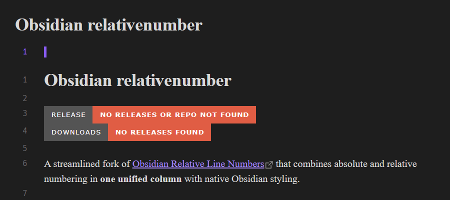

# Obsidian relativenumber

A streamlined fork of [Obsidian Relative Line Numbers](https://github.com/nadavspi/obsidian-relative-line-numbers) that combines absolute and relative numbering in **one unified column** with native Obsidian styling.

**Key Improvements**:  
✓ **Single-column Design**  
  - Matches Obsidian's native line number column width  
  - Current line: Shows absolute number in **Obsidian Accent Color**  
  - Other lines: Display relative numbers  
  - Uses **Obsidian Monospace Font** throughout  

**Requirements**:  
-  Enable "Show line number" in Obsidian's Editor settings  

### Why This Fork?
This modification merges the original dual-column display into a space-efficient single column while:  
1. Maintaining visual consistency with Obsidian's native interface  
2. Preserving quick orientation (absolute current line number)  
3. Keeping relative numbers for navigation efficiency  

### Acknowledgements
Built upon [nadavspi/obsidian-relative-line-numbers](https://github.com/nadavspi/obsidian-relative-line-numbers). Gratitude to the original author for creating the base implementation.
